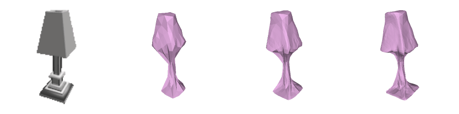
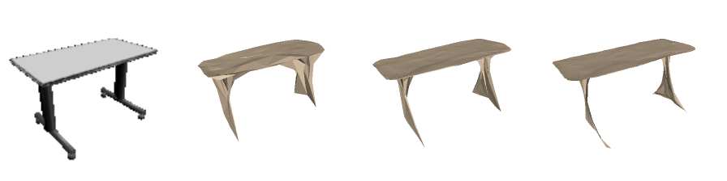
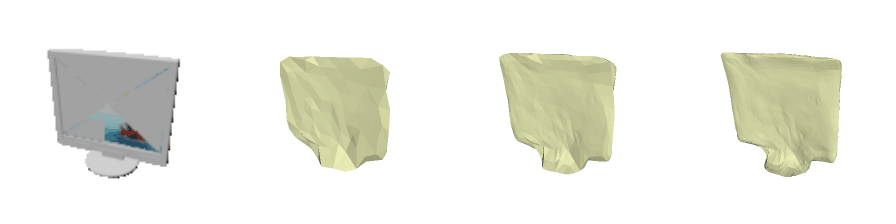

# Pixel2Mesh for 3D Face Reconstrcution

This is an implement of Pixel2Mesh for 3D Face Reconstruction. Our repository is based on the pytorch version of Pixel2Mesh in PyTorch of [this](https://github.com/noahcao/Pixel2Mesh).

#Our Work

- Some targeted structural improvements have been made for the use of 3d face datasets.
- Train the model on the AFLW2000-3D dataset.
- Add some data preprocess method for 3d face dataset.


## Get Started

### Environment

Current version only supports training and inference on GPU. It works well under dependencies as follows:

- Ubuntu 16.04 / 18.04
- Python 3.7
- PyTorch 1.1
- CUDA 9.0 (10.0 should also work)

Other conda environments can be found in the `requirements.txt`

After you have created and install the related dependencies, you should also done:

1. `git submodule update --init` to get [Neural Renderer](https://github.com/daniilidis-group/neural_renderer) ready.
2. `python setup.py install` in directory [external/chamfer](external/chamfer) and `external/neural_renderer` to compile the modules.

### Datasets

We use [AFLW2000-3D](https://www.shapenet.org/) for model training and evaluation.You should organize your 'datasets' as following trees.

datasets/data
├── semi-sphere
│   ├── semi1.obj
│   ├── semi2.obj
│   ├── semi3.obj
|   ├── semi4.obj
│   └── semi.dat
├── pretrained
│   ... (.pth files)
└── AFLW2000-3D
    ├── AFLW2000
    │   ├── 02691156
    │   │   └── 3a123ae34379ea6871a70be9f12ce8b0_02.dat
    │   ├── 02828884
    │   └── ...
    ├── data_tf (standard data used in official implementation)
    │   ├── 02691156 (put the folders directly in data_tf)
    │   │   └── 10115655850468db78d106ce0a280f87
    │   ├── 02828884
    │   └── ...
    └── meta
    └── nme
    
        ...
```

Some information about the datasets:

### Usage

#### Configuration

You can modify configuration in a `yml` file for training/evaluation. It overrides dsefault settings in `options.py`. We provide some examples in the `experiments` directory. 

#### Training

```
python entrypoint_train.py --name xxx --options path/to/yaml
```
#### Training example
```
python entrypoint_train.py --name tmp --options experiments/default/tensorflow.yml
```

*P.S. To train on slurm clusters, we also provide settings reference. Refer to [slurm](slurm) folder for details.*

#### Evaluation

```shell
python entrypoint_eval.py --name xxx --options path/to/yml --checkpoint path/to/checkpoint
```

#### Inference

You can do inference on your own images by a simple command:

``` 
python entrypoint_predict.py --options /path/to/yml --checkpoint /path/to/checkpoint --folder /path/to/images
```

*P.S. we only support do training/evaluation/inference with GPU by default.*

## Results

We tested performance of some models. The [official tensorflow implementation](https://github.com/nywang16/Pixel2Mesh) reports much higher performance than claimed in the [original paper](https://arxiv.org/abs/1804.01654) as follows. The results are listed as follows, which is close to that reported in [MeshRCNN](https://arxiv.org/abs/1906.02739).  The original paper evaluates result on simple mean, without considerations of different categories containing different number of samples, while some later papers use weighted-mean. We report results under both two metrics for caution.

<table>
  <thead>
    <tr>
      <th>Checkpoint</th>
      <th>Eval Protocol
      <th>CD</th>
      <th>F1<sup>τ</sup></th>
      <th>F1<sup>2τ</sup></th>
    </tr>
  </thead>
  <tbody>
    <tr>
      <td rowspan=2>Official Pretrained (tensorflow)</td>
      <td>Mean</td>
      <td>0.482</td>
      <td>65.22</td>
      <td>78.80</td>
    </tr>
    <tr>
      <td>Weighted-mean</td>
      <td>0.439</td>
      <td><b>66.56</b></td>
      <td><b>80.17</b></td>
    </tr>
    <tr>
      <td rowspan=2>Migrated Checkpoint</td>
      <td>Mean</td>
      <td>0.498</td>
      <td>64.21</td>
      <td>78.03</td>
    </tr>
    <tr>
      <td>Weighted-mean</td>
      <td>0.451</td>
      <td>65.67</td>
      <td>79.51</td>
    </tr>
    <tr>
      <td rowspan=2>ResNet</td>
      <td>Mean</td>
      <td><b>0.443</b></td>
      <td><b>65.36</b></td>
      <td><b>79.24</b></td>
    </tr>
    <tr>
      <td>Weighted-mean</td>
      <td><b>0.411</b></td>
      <td>66.13</td>
      <td>80.13</td>
    </tr>
  </tbody> 
</table>

*P.S. Due to time limit, the resnet checkpoint has not been trained in detail and sufficiently.*

### Pretrained checkpoints

- **VGG backbone:** The checkpoint converted from official pretrained model  (based on VGG) can be downloaded [here](https://drive.google.com/file/d/1Gk3M4KQekEenG9qQm60OFsxNar0sG8bN/view?usp=sharing). (scripts to migrate tensorflow checkpoints into `.pth` are available in `utils/migrations`. )
- **ResNet backbone:** As we provide another backbone choice of resenet, we also provide a corresponding checkpoint [here](https://drive.google.com/file/d/1pZm_IIWDUDje6gRZHW-GDhx5FCDM2Qg_/view?usp=sharing). 

## Details of Improvement

We explain some improvement of this version of implementation compared with the official version here.

- **Larger batch size:** We support larger batch size on multiple GPUs for training. Since Chamfer distances cannot be calculated if samples in a batch with different ground-truth pointcloud size, "resizing" the pointcloud is necessary. Instead of resampling points, we simply upsample/downsample from the dataset.
- **Better backbone:** We enable replacing VGG by ResNet50 for model backbone. The training progress is more stable and final performance is higher.
- **More stable training:** We do normalization on the deformed sphere, so that it's deformed at location $(0,0,0)$; we use a threshold activation on $z$-axis during projection, so that $z$ will always be positive or negative and never be $0$. These seem not to result in better performance but more stable training loss.

## Demo

Generated mesh samples are provided in [datasets/examples](datasets/examples) from our ResNet model. Three mesh models in a line are deformed from a single ellipsoid mesh with different number of vertices (156 vs 268 vs 2466) as configurated in the original paper. 








## Acknowledgements

Our work is based on the official version of [Pixel2Mesh](https://github.com/nywang16/Pixel2Mesh); Some part of code are borrowed from [a previous PyTorch implementation of Pixel2Mesh](https://github.com/Tong-ZHAO/Pixel2Mesh-Pytorch). The packed files for two version of datasets are also provided by them two. Most codework is done by [Yuge Zhang](https://github.com/ultmaster).
